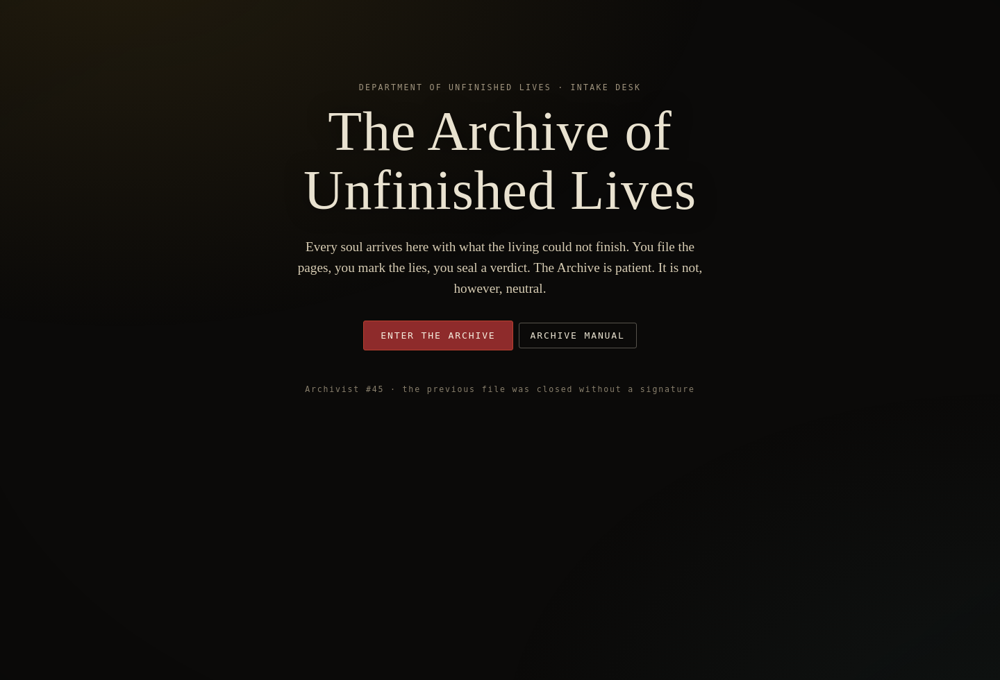
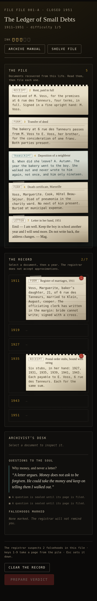

<div align="center">

# The Archive of Unfinished Lives

**A bureaucratic afterlife, played one file at a time.**

Sort the paper a stranger left behind. Mark the pages that cannot both be true.
Spend your ink carefully, then sign a verdict on somebody you will never meet.

[](LICENSE)
[](#architecture)
[](#run-it)




</div>

---

## What it is

You are Archivist #45 in the **Department of Unfinished Lives**. The dead arrive with their
paperwork incomplete: a rent receipt, a shift card, a deposition from a neighbour, a letter
somebody finally taught themselves to write. Your job is not to grieve. Your job is to file.

Each case gives you a pile of documents and a timeline of years. You decide which year each page
belongs to, you mark the two pages that cannot both be true, and you spend **ink** — five measures
per file, none carried over — asking the soul a few questions. Then you name the dominant virtue,
the dominant wound, and seal one of three verdicts: **Release**, **Return**, or **Retain**.

Most of the files are lies told in good handwriting. Not by villains, usually. By clerks.

## Why it is different

- **The puzzle is reading, not reflexes.** Every case hides one real deduction inside dull
  administrative prose — a date that cannot be right, a signature in the wrong hand, quantities
  that do not add up to the story the file tells about itself.
- **The record is the antagonist.** The misreading is always bureaucratic: the form had two fields
  for a woman and neither of them was "competent", so the file says *dependent*.
- **Judgement is scored, not merely clicked.** Naming the right virtue, the right wound and the
  right verdict is worth more than filing every page correctly. You can be tidy and still be wrong.
- **Ink is finite and it does not come back.** Asking everything is impossible by construction; the
  linter rejects any case where it is not.
- **No build step, no dependencies, no network calls.** Plain ES modules, one static folder.
- **There is a story under the story.** Every case ends with a line from the same unexplained hand
  in the margins. It is going somewhere, and the last file is yours.

## Run it

```bash
git clone https://github.com/fevnem/unfinished-lives
cd unfinished-lives
python3 -m http.server 8130
# open http://localhost:8130
```

Any static file server works — the game is `index.html` plus ES modules. No install, no build, no
`node_modules`.

## How to play

| | |
|---|---|
| **1. Read the pile** | Click a page to inspect it. Documents do not announce their year. |
| **2. File it** | With a page selected, click a year on the record — or press `1`–`9` to take a page from the pile and `Esc` to set it down. |
| **3. Mark falsehoods** | Select a filed page, press **Mark as false**, then select the page it contradicts. The registrar tells you how many to expect. |
| **4. Spend ink** | A question unlocks only after its page is filed. Five measures per file; asked questions are answered in the soul's own voice. |
| **5. Seal a verdict** | Name the dominant virtue, the dominant wound, and one of the three verdicts. A sealed verdict cannot be revised. |



Your reading is scored out of 100 and ranked — `S` is *the Archivist would have signed this*, `D` is
*the record goes back into the pile* — on **pages filed**, **falsehoods caught** (wrong marks cost
you), **virtue, wound and verdict**, and **ink left unspent**. Progress saves itself as you go.

## The files

Every case is one file in `js/content/`, written to a frozen contract, and validated by a linter
before it can ship. (`case-00` is the tutorial; `case-meta` is the finale.)

Thirty-two files: `case-00` teaches the desk, `case-01`–`case-30` are the shelf you work
through, and `case-meta` is the last envelope in the building. Playing a file perfectly
scores 100/100 — rank S. **The verdicts are deliberately not listed here: working out
which one is earned is the game.**

| file | case | era | setting | difficulty | the record |
|---|---|---|---|---|---|
| `case-00` | **The Ledger of Small Debts** | 1911–1951 | Baker, later cook | 1/5 | 7 pages · 2 falsehoods |
| `case-01` | **The Furnace Under Another Name** | 1889–1922 | Glass furnaceman, night hand | 2/5 | 10 pages · 3 falsehoods |
| `case-02` | **The Woman Who Kept the Book** | 1901–1938 | Filed as none. Kept the harbour wage book, 1908–1919 | 2/5 | 9 pages · 3 falsehoods |
| `case-03` | **The Names He Made Up** | 1914–1946 | Clerk, registration office | 3/5 | 8 pages · 3 falsehoods |
| `case-04` | **Eleven Women, One Tremor** | 1923–1961 | Trim-line hand, Kessler Motors; later laundress | 3/5 | 9 pages · 3 falsehoods |
| `case-05` | **The Cause She Would Not Sign** | 1933–1972 | Nurse, later ward sister, ward 4 | 3/5 | 10 pages · 4 falsehoods |
| `case-06` | **The Technician With No File** | 1947–1980 | Radio technician, later unnamed caretaker of the transmitter | 4/5 | 10 pages · 3 falsehoods |
| `case-07` | **The Entry In Another Hand** | 1958–1991 | Able seaman, motor ferry Casablanca–Marseille | 2/5 | 8 pages · 3 falsehoods |
| `case-08` | **Nine Days of Plates** | 1969–2003 | Cook; eleven years in a restaurant kitchen | 3/5 | 9 pages · 3 falsehoods |
| `case-09` | **The Survey Dated After the Fall** | 1897–1935 | Slate quarryman, later clerk of returns | 3/5 | 11 pages · 4 falsehoods |
| `case-10` | **Three Men in One Ledger** | 1905–1944 | Porter; office clerk; linesman, Uganda Railway, Nairobi depot | 3/5 | 9 pages · 3 falsehoods |
| `case-11` | **Two Hundred and Fourteen Items** | 1912–1950 | Pawnbroker's wife, later pawnbroker, 41 Meath Street | 3/5 | 10 pages · 3 falsehoods |
| `case-12` | **The Signature of a Dead Schoolmaster** | 1921–1965 | Schoolmistress, the county school at Litton, upper Wharfedale | 4/5 | 10 pages · 4 falsehoods |
| `case-13` | **One Digit Wrong** | 1928–1972 | Seamstress, Brás; later laundress | 3/5 | 9 pages · 3 falsehoods |
| `case-14` | **The Dress List for a Lost Film** | 1934–1978 | Costume maker, later wardrobe assistant | 3/5 | 9 pages · 3 falsehoods |
| `case-15` | **Fourteen Years in Her Mother's Hand** | 1940–1985 | Cloth trader, stall 212, Balogun Market | 4/5 | 8 pages · 3 falsehoods |
| `case-16` | **The Page Cut Out of the File** | 1955–1999 | Welder, later checker of welds; Cairnbrae yard, Govan | 4/5 | 9 pages · 3 falsehoods |
| `case-17` | **The Man He Pulled Out** | 1871–1908 | Hog floor; killer, later hasher man, No. 4 hasher | 3/5 | 10 pages · 3 falsehoods |
| `case-18` | **The Register That Burned** | 1883–1919 | Parish midwife, Sörby | 3/5 | 9 pages · 3 falsehoods |
| `case-19` | **What He Burned to Stay Alive** | 1890–1925 | Mail carrier, Dawson–Forty Mile trail; later store clerk, Dawson | 3/5 | 10 pages · 3 falsehoods |
| `case-20` | **The Stoppage Entered as Sabotage** | 1900–1936 | Loom hand, shed C, Nilkanta Jute Mills | 4/5 | 9 pages · 3 falsehoods |
| `case-21` | **The Confession He Dictated** | 1918–1952 | Seamstress, Bragança, Rua da Atalaia; later laundress | 3/5 | 8 pages · 3 falsehoods |
| `case-22` | **The Disease Without a Name Yet** | 1929–1968 | Physician and surgeon; camp doctor, later a practice without a licence | 4/5 | 9 pages · 3 falsehoods |
| `case-23` | **Four Reports and No Action** | 1940–1979 | Signalman, Abidjan–Niger railway; later yard gatekeeper | 3/5 | 8 pages · 3 falsehoods |
| `case-24` | **The Measurements She Copied** | 1950–1988 | Dye-house hand, later sample-room assistant | 4/5 | 10 pages · 3 falsehoods |
| `case-25` | **The Longer Road That Night** | 1962–1999 | Ambulance officer, night driver | 3/5 | 9 pages · 3 falsehoods |
| `case-26` | **The Pages That Were Never Scanned** | 1974–2011 | Scanning operator, grade 3, later supervisor, Site 2 | 4/5 | 10 pages · 3 falsehoods |
| `case-27` | **Sixty-One Plates Nobody Paid For** | 1868–1905 | Printer's hand and counter girl, photographic studio | 3/5 | 9 pages · 3 falsehoods |
| `case-28` | **The Shift That Wasn't There** | 1908–1945 | Barretero (driller), capataz of cuadrilla 7 | 4/5 | 10 pages · 3 falsehoods |
| `case-29` | **The Ship That Did Not Sail** | 1930–1971 | Assistant keeper, then keeper, Havbjerg light | 4/5 | 10 pages · 3 falsehoods |
| `case-30` | **The Wardrobe Nobody Collected** | 1968–2005 | Laundress, hospital laundry | 2/5 | 10 pages · 3 falsehoods |
| `case-meta` | **The Forty-Fourth Archivist** | Unrecorded | Registrar, Department of Unfinished Lives | 5/5 | 8 pages · 2 falsehoods |

## Architecture

```
index.html              the shell
css/
  base.css              palette, typography, layout
  fragments.css         the document-card system (paper stock per kind)
  timeline.css          the record: years and slots
  responsive.css        small screens
js/
  main.js               bootstrap: load cases, restore the save, wire the router
  engine/
    vocab.js            frozen vocabulary — verdicts, virtues, wounds, kinds
    store.js            run state, localStorage save/load, transitions
    rules.js            scoring (pure) — pages, falsehoods, judgement, ink
    registry.js         case loader; a broken case file is skipped, not fatal
  ui/
    dom.js              tiny DOM helper (no framework, no virtual DOM)
    screens.js          router, title, intake, epilogue, shelved files, manual
    desk.js             the pile, the record, the contradictions, the questions
    verdict.js          the verdict form and the seal
  fx/
    ink.js              procedural paper sounds and progressive text reveal
  content/
    case-00.js          the tutorial (also the reference implementation)
    case-01.js …        one case per file, one author per file
    case-meta.js        the finale
tools/
  lint-cases.mjs        validates every case against the contract
  verify-cases.mjs      plays every case perfectly in Chromium; asserts 100/100
  screens.mjs           drives a real Chromium over CDP: full playthrough + screenshots
assets/
  favicon.svg
```

### Adding a case

Write one file, `js/content/case-NN.js`, exporting a default object. Nothing else needs editing:
the registry picks it up, the linter validates it, the desk plays it. Run
`node tools/lint-cases.mjs` and it will tell you exactly what is missing.

```js
export default {
  id: 'case-01',                 // must equal the filename
  order: 1,                      // play order; 0 = tutorial, 99 = finale
  title: 'The Weight of Small Debts',
  subtitle: 'File 114-B · Closed 1974',
  difficulty: 2,                 // 1–5
  era: '1931–1974',
  dossier: { name, alias, age, occupation, place, cause, entry, registrar },
  intake: 'One paragraph from the intake officer. Sets the tone.',
  slots: ['1931', '1938', '1946', '1955', '1963', '1971'],   // 5–9 years
  fragments: [{
    id: 'case-01-f1',            // <caseid>-f<n>, unique
    kind: 'letter',              // letter|form|receipt|transcript|photo|object|margin
    label: 'Short title',
    text: 'One to four sentences of the actual document text.',
    anchor: '1946',              // the year it really belongs to — one of `slots`
    note: 'Optional archivist annotation.',
    unlocks: 'q1'                // optional: question id this page unlocks
  }],
  contradictions: [{ a: 'case-01-f1', b: 'case-01-f5', reason: 'Why these cannot both be true.' }],
  questions: [{ id: 'q1', cost: 1, requires: 'case-01-f1', prompt: 'What you ask.', answer: 'How they answer.' }],
  key: { virtue: 'Endurance', wound: 'Abandonment', verdict: 'Release', truth: 'What really happened.' },
  epilogue: { Release: '…', Return: '…', Retain: '…' },
  foreshadow: 'One line that hints at the meta-story.'
};
```

Rules the linter enforces: 7–11 fragments across at least 3 kinds; ids prefixed with the case id;
every anchor one of your `slots`; 2–4 contradictions naming real fragments; 3–6 questions whose
total cost **exceeds** the ink you start with, so asking everything is impossible; `key.virtue` and
`key.wound` from the frozen vocabulary; an epilogue for all three verdicts; exactly one `margin`
fragment — the previous Archivist's hand, hinting at the meta-arc without explaining it.

## Development

```bash
node tools/lint-cases.mjs             # validate every case file against the contract
node tools/verify-cases.mjs           # play EVERY case perfectly in Chromium; must score 100/100
node tools/screens.mjs                # drive the real game through a full session (12 checks) + screenshots
node tools/screens.mjs --flow desk    # just the desk screen
```

`verify-cases.mjs` is the strict one: it files every page at its true anchor, marks every real
falsehood, names the case's own key and seals the verdict — a case that scores anything but
100 is contradicting itself. `screens.mjs` talks raw CDP to a local Chromium using Node's built-in
`WebSocket` — no test framework, no Puppeteer, no dependencies. It fails on any uncaught page error.

## Credits

Written and built by [Rakib Hasan](https://github.com/fevnem). Want to write a case?
See [CONTRIBUTING.md](CONTRIBUTING.md) — it is one file and a linter.

MIT licensed — see [LICENSE](LICENSE). The people in these files are invented. The paperwork
is not.
